<h1 align="center">Typecial </h1>

A fun way to up your typing skill.

<h3>Project</h3>

This project us different than other typing test/game in a way. This doesn't include any english word that makes sense at all. It is all jibberish word randomized to make it tuff for us to process the letters and enter. This takes game to next level dificulaty and even so called pro typers tend to lag behind in this one. The measurement of speed here, in this context is Characters per minute(CPM).

<h3> Features and Functionalities </h3>

- Unique  
- User friendly  
- uniqie database for every user  
- stats for past performance to determine skill growth  

<h3> Screenshot </h3>
<h4>Home Page</h4>

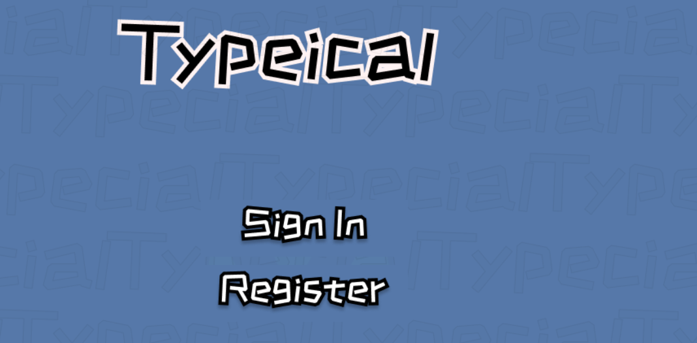
<h4> Registration Page </h4>

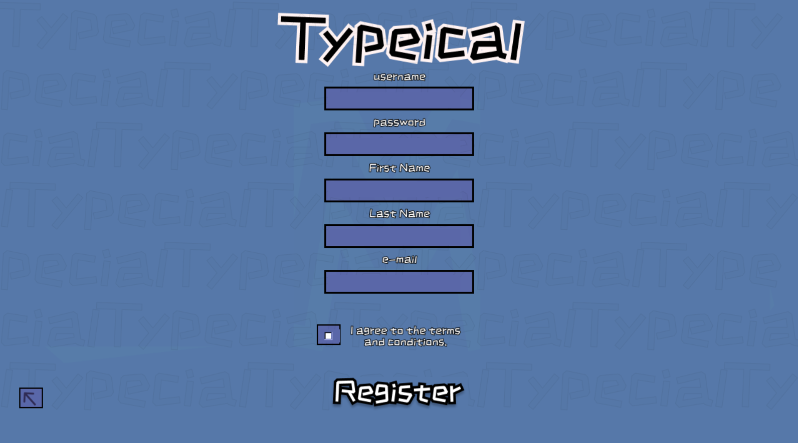
<h4>Login Page</h4>

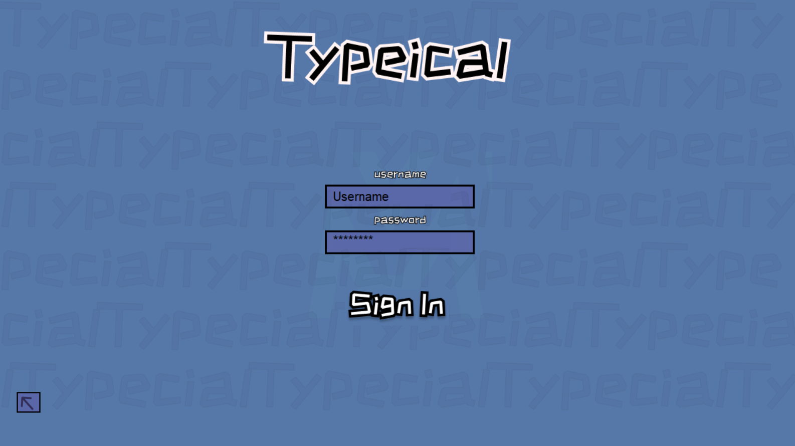
<h4>The Main Type Page</h4>

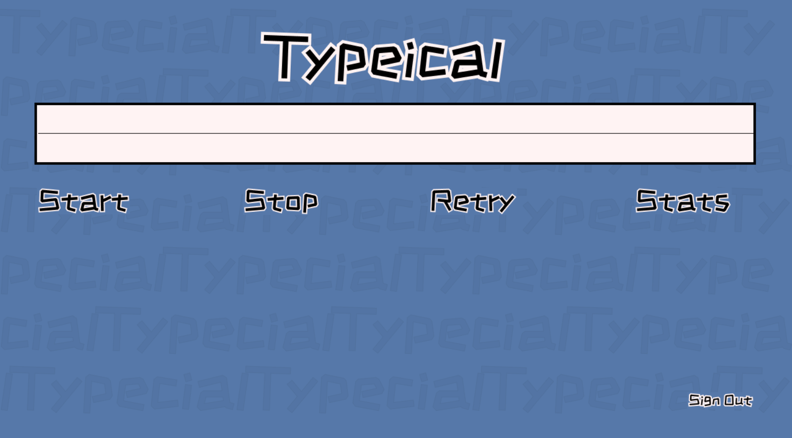
<h4>The Stats Page</h4>

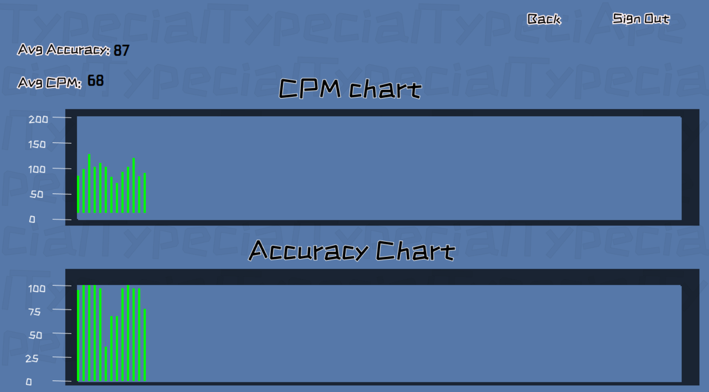
<h3>Tools Used</h3>

- Python
 
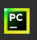
- Tkinter
 
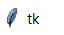
- SQLite3
 
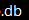
- Figma
 
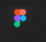

<h3>Testing</h3>

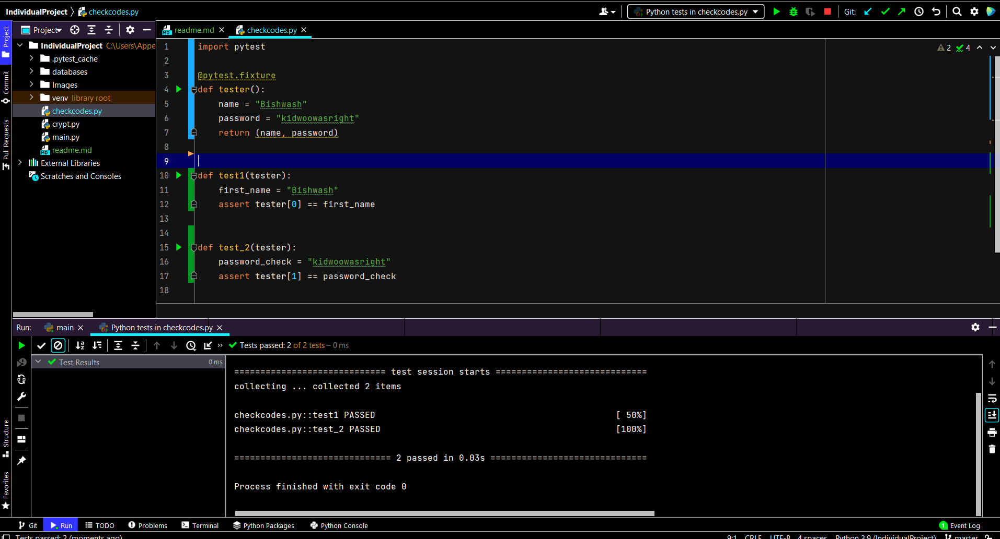

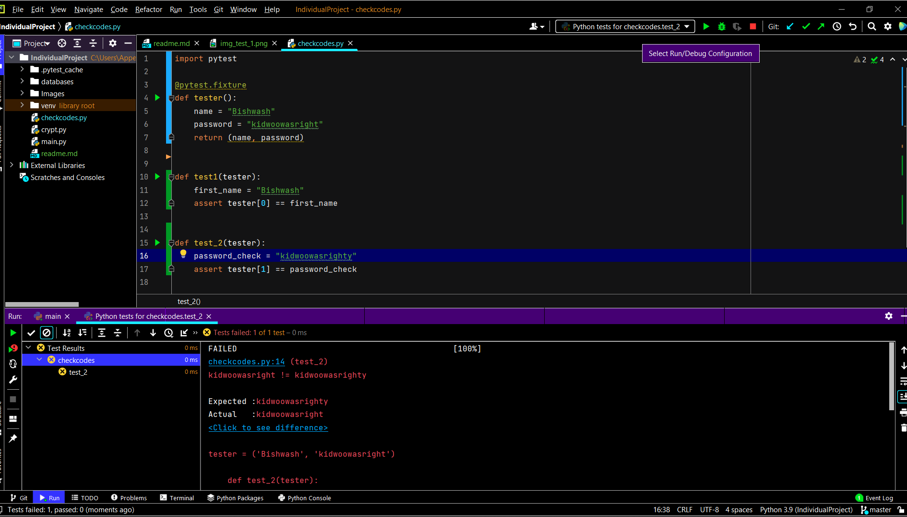
